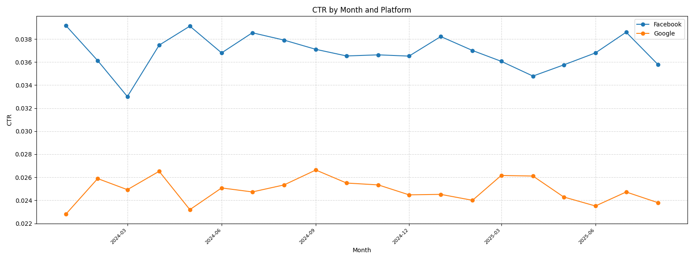
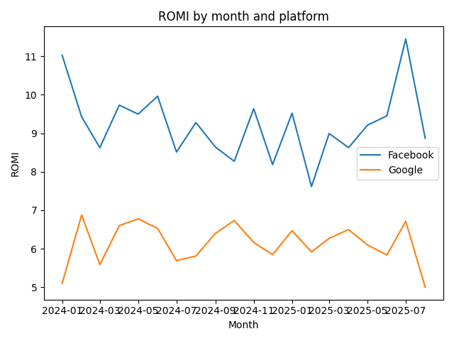
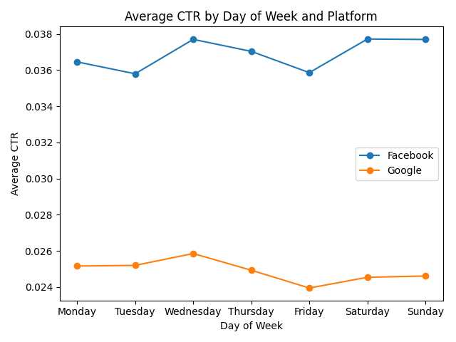
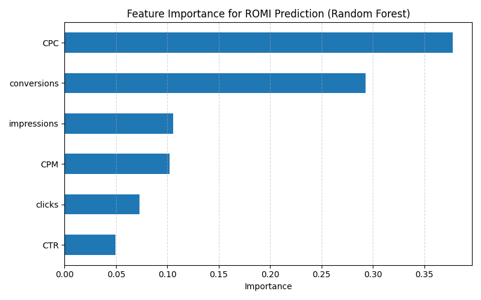

# Cross‑Platform Advertising Campaign Performance Analysis (2025)

## About me / על עצמי

### 🇬🇧 English
I am a data analyst with a focus on digital marketing.  I built this project
to demonstrate how I evaluate the effectiveness of advertising campaigns
across multiple platforms using both SQL and Python.  My goal was to
derive actionable insights and present them clearly for non‑technical
stakeholders.

### 🇮🇱 עברית
אני אנליסט נתונים שמתמקד בשיווק דיגיטלי.  בניתי את הפרויקט הזה כדי
להראות כיצד אני מעריך את יעילותן של קמפיינים פרסומיים במספר
פלטפורמות באמצעות SQL ו‑Python.  המטרה שלי הייתה להפיק תובנות
מעשיות ולהציג אותן בצורה ברורה גם לקהל לא טכני.

## Project overview / סקירת הפרויקט

### 🇬🇧 English
In this project I analysed synthetic daily data from Facebook Ads and
Google Ads covering the period from **1 January 2024** to **31 August 2025**.
I created a PostgreSQL table, loaded the data, calculated key
performance indicators (KPI) such as cost per click (CPC), cost per
mille (CPM), click‑through rate (CTR) and return on marketing
investment (ROMI).  I then extended the analysis in Python to
visualise monthly trends, compare channels and build a linear regression
model to predict ROMI.

### 🇮🇱 עברית
בפרויקט הזה ניתחתי נתונים יומיים סינתטיים של מודעות בפייסבוק ובגוגל
לתקופה שבין **1 בינואר 2024** לבין **31 באוגוסט 2025**.  יצרתי טבלה
ב‑PostgreSQL, הטענתי את הנתונים וחישבתי מדדי ביצוע מרכזיים כגון עלות
להקלקה (CPC), עלות לאלף חשיפות (CPM), שיעור הקלקה (CTR) והחזר על
השקעת שיווק (ROMI).  לאחר מכן הרחבתי את הניתוח ב‑Python כדי
להמחיש מגמות חודשיות, להשוות בין הערוצים ולבנות מודל רגרסיה
ליניארית לחיזוי ROMI.

## Key metrics / מדדים מרכזיים

### 🇬🇧 English
I evaluated campaign performance using four key metrics:

- **CPC** – the amount paid for every click.  A low CPC means clicks are
  cheap while a high CPC indicates that each click is expensive【948272032911912†L162-L168】.
- **CPM** – the average cost per thousand impressions.  CPM is useful when
  the goal is brand awareness【948272032911912†L229-L247】.
- **CTR** – the percentage of impressions that resulted in a click【948272032911912†L382-L392】.  High
  CTR suggests that the creative and targeting resonate with the audience.
- **ROMI** – the ratio of net profit to marketing spend【494841379040022†L36-L45】.  It tells me whether
  the revenue generated covers the advertising cost.

These metrics complement each other: CPC and CPM measure spending
efficiency, CTR captures engagement, and ROMI reflects profitability.

### 🇮🇱 עברית
הערכתי את ביצועי הקמפיין באמצעות ארבעה מדדים עיקריים:

- **CPC** – הסכום ששילמתי עבור כל הקלקה; CPC נמוך מצביע על הקלקות
  זולות בעוד CPC גבוה מעיד על עלות גבוהה לכל הקלקה【948272032911912†L162-L168】.
- **CPM** – עלות ממוצעת לאלף חשיפות; המדד שימושי כאשר המטרה היא
  מודעות למותג【948272032911912†L229-L247】.
- **CTR** – אחוז החשיפות שהובילו להקלקה【948272032911912†L382-L392】; CTR
  גבוה מעיד שהקריאייטיב והטירגוט מדויקים.
- **ROMI** – היחס בין הרווח נטו להוצאה על שיווק【494841379040022†L36-L45】; המדד מראה אם ההכנסות
  מכסות את עלות הפרסום.

מדדים אלה משלימים זה את זה: CPC ו‑CPM מודדים יעילות הוצאה, CTR משקף
מעורבות ו‑ROMI מבטא רווחיות.

## Project story and challenges / סיפור הפרויקט ואתגרים

### 🇬🇧 English
I began this portfolio project by generating a realistic dataset that spans
2024–2025 and includes daily performance metrics for Facebook and
Google. My goal was to compare the two channels and decide where to
allocate advertising spend. Along the way I encountered several
challenges. First, I needed to clean and structure the synthetic data
so that it would behave like a real campaign database. Then I tuned
SQL queries to aggregate millions of impressions efficiently and
checked that calculated KPIs were consistent with industry
definitions. Finally, I noticed week‑to‑week volatility in cost and
revenue, which made it difficult to see underlying trends. To address
this, I calculated moving averages and segmented the analysis by time
periods. By documenting each hurdle and how I solved it, I built a
comprehensive pipeline that not only crunches numbers but tells a
cohesive story of my analytical process.

### 🇮🇱 עברית
התחלתי את פרויקט הפורטפוליו הזה ביצירת מערך נתונים מציאותי
שמשתרע על פני השנים 2024–2025 וכולל מדדי ביצועים יומיים לפייסבוק
ולגוגל. המטרה שלי הייתה להשוות בין שני הערוצים ולהחליט היכן
להקצות את תקציב הפרסום. במהלך העבודה נתקלתי בכמה אתגרים.
תחילה הייתי צריך לנקות ולבנות את הנתונים הסינתטיים כך שיתנהגו
כמו בסיס נתונים אמיתי של קמפיין. לאחר מכן כווננתי את שאילתות ה‑SQL
כדי לאגד מיליוני הופעות ביעילות ובדקתי שה‑KPI המחושבים עולים בקנה
אחד עם הגדרות המקובלות בתעשייה. לבסוף שמתי לב לתנודתיות משבוע
לשבוע בעלויות ובהכנסות, שהקשתה על זיהוי מגמות ארוכות טווח.
כדי להתמודד עם זה חישבתי ממוצעים נעים ופילחתי את הניתוח
לפי תקופות זמן. על ידי תיעוד כל מכשול וכיצד פתרתי אותו בניתי
צינור ניתוח מקיף שלא רק מחשב מספרים אלא מספר סיפור שלם על
תהליך העבודה שלי.

## Dataset / מערך הנתונים

### 🇬🇧 English
The file [`ads_data.csv`](./ads_data.csv) contains synthetic daily records
for Facebook and Google.  Each row includes the date, platform,
impressions, clicks, cost, conversions and revenue.  The data was
generated to reflect realistic growth in budget and engagement over
time.  Facebook generally achieves higher CTR and lower CPM, while
Google delivers fewer but possibly higher‑value conversions.  Because
the dataset is artificial, it is safe to publish as part of a portfolio.

### 🇮🇱 עברית
קובץ [`ads_data.csv`](./ads_data.csv) מכיל נתונים יומיים סינתטיים
לפייסבוק ולגוגל.  כל שורה כוללת את התאריך, הפלטפורמה, מספר
החשיפות, ההקלקות, העלות, ההמרות וההכנסות.  הנתונים נוצרו כך
שישקפו צמיחה ריאלית בתקציב ובמעורבות לאורך זמן.  בדרך כלל,
פייסבוק מגיעה ל‑CTR גבוה יותר ו‑CPM נמוך יותר, בעוד שגוגל מביאה
פחות, אך ייתכן שהמרות באיכות גבוהה יותר.  מאחר שמדובר בנתונים
מלאכותיים, ניתן לפרסם אותם בפורטפוליו.

## SQL analysis / ניתוח SQL

### 🇬🇧 English
I wrote [queries.sql](./queries.sql) to set up the table, load the CSV
file and calculate KPIs.  The script includes:

1. A **table definition** for `ads_data` with columns for date,
   platform, impressions, clicks, cost, conversions and revenue.
2. Examples of how to **load the CSV** using PostgreSQL’s `COPY` command.
3. **Aggregated KPIs per platform** and overall using grouping sets.
4. **Monthly aggregation** of metrics by platform.
5. A **month‑over‑month trend analysis** using window functions.
6. An example to **identify top performing months** by ROMI subject to a minimum spend.
7. A query to **rank platforms by ROMI** each month and highlight which channel performed best.

These queries allowed me to understand performance differences between
channels and identify periods of exceptional return.

### 🇮🇱 עברית
כתבתי את [queries.sql](./queries.sql) כדי להגדיר את הטבלה, לטעון את קובץ
ה‑CSV ולחשב את מדדי הביצוע.  הסקריפט כולל:

1. **הגדרת טבלה** ל‑`ads_data` עם עמודות לתאריך, פלטפורמה, חשיפות,
   הקלקות, עלות, המרות והכנסות.
2. דוגמאות כיצד **לטעון את קובץ ה‑CSV** באמצעות הפקודה `COPY` של
   PostgreSQL.
3. **חישוב KPI מצטברים** לכל פלטפורמה ובסה״כ באמצעות `GROUPING SETS`.
4. **אגד מדדים לפי חודש ופלטפורמה**.
5. **ניתוח מגמת חודש על חודש** באמצעות פונקציות חלון.
6. דוגמה ל‑**זיהוי החודשים הטובים ביותר** לפי ROMI תחת סף הוצאה
   מסוים.
7. שאילתה שמדרגת פלטפורמות לפי ROMI בכל חודש ומדגישה איזו
   ערוץ היה הטוב ביותר.

השאילתות האלה מאפשרות לי להבין את ההבדלים בביצועים בין ערוצים
ולזהות תקופות עם החזר גבוה במיוחד.

## Python analysis / ניתוח ב‑Python

### 🇬🇧 English
To deepen the analysis, I wrote a [Python script](./analysis.py) that
reads the CSV file, computes the same KPIs, aggregates them by
platform and month, and trains a linear regression model to predict
ROMI using impressions, clicks, cost and conversions as features.
 The script saves several charts (included in this repository).  Key
findings include:

- **Aggregated performance:** Facebook outperformed Google across all
  metrics.  Its CTR (≈3.7%) was higher than Google’s (≈2.5%); CPC and
  CPM were lower; and ROMI was around 9.2 versus Google’s 6.1.
- **Monthly trends:** CTR and ROMI fluctuated over time but
  generally increased from early 2024 towards mid‑2025.  The charts
  below show how each channel evolved.
- **Predictive modelling:** A simple linear regression explained
  about 60% of the variance in ROMI (R²≈0.60).  This suggests cost,
  clicks, impressions and conversions together provide a useful but
  not exhaustive prediction.

You can run the script with `python analysis.py` after installing the
dependencies listed in `requirements.txt`.  The generated charts are
embedded below.

### 🇮🇱 עברית
כדי להעמיק את הניתוח כתבתי [סקריפט ב‑Python](./analysis.py) שקורא את
קובץ ה‑CSV, מחשב את אותם KPI, מאגד אותם לפי פלטפורמה וחודש
ומאמן מודל רגרסיה ליניארית לחיזוי ROMI באמצעות חשיפות, הקלקות,
עלות והמרות כמאפיינים.  הסקריפט שומר מספר גרפים (שמצורפים
ברפוזיטורי).  הממצאים העיקריים:

- **ביצועים מצטברים:** פייסבוק עלתה על גוגל בכל המדדים.  CTR שלה
  (≈3.7%) גבוה מזה של גוגל (≈2.5%); ה‑CPC וה‑CPM נמוכים יותר; וה‑ROMI
  כ‑9.2 לעומת 6.1.
- **מגמות חודשיות:** CTR ו‑ROMI השתנו לאורך זמן אך נוטים לעלות
  מתחילת 2024 ועד אמצע 2025.  הגרפים למעלה מראים כיצד כל ערוץ
  השתנה.
- **מודל חיזוי:** רגרסיה ליניארית פשוטה הסבירה כ‑60% מהשונות
  ב‑ROMI (R²≈0.60).  זה מצביע על כך שהעלות, ההקלקות, החשיפות
  וההמרות יחד מספקים חיזוי שימושי אך לא מלא.

ניתן להריץ את הסקריפט באמצעות `python analysis.py` לאחר התקנת
התלויות המפורטות ב‑`requirements.txt`.  הגרפים שנוצרו משולבים
לעיל.

## Advanced analysis / ניתוח מתקדם

### 🇬🇧 English
To push the analysis further I wrote an additional script,
[`advanced_analysis.py`](./advanced_analysis.py).  This module segments
performance by **day of week** and builds a **Random Forest** model to
understand which factors drive ROMI.  The day‑of‑week segmentation
revealed interesting patterns: for example, Facebook’s CTR peaked on
Mondays while Google performed slightly better mid‑week.  I visualised
these patterns in the chart below.  The Random Forest explained about
50 % of the variation in ROMI (R²≈0.50).  The feature importance
chart shows that **CPC** and **conversions** are the most influential
drivers, followed by impressions and CPM.  This suggests that
lowering the cost per click and improving conversion rates will have
the greatest impact on profitability.  All outputs are saved in this
repository: a summary file (`advanced_analysis_summary.txt`), a
day‑of‑week metrics table (`analysis_day_platform_metrics.csv`) and two
new charts.

### 🇮🇱 עברית
כדי להעמיק עוד יותר את הניתוח כתבתי סקריפט נוסף,
[`advanced_analysis.py`](./advanced_analysis.py).  המודול הזה מפלח את
הביצועים לפי **יום בשבוע** ובונה מודל **Random Forest** כדי להבין
אילו גורמים משפיעים על ROMI.  הפילוח לפי יום בשבוע חשף דפוסים
מעניינים: למשל, ה‑CTR של פייסבוק הגיע לשיא בימי שני בעוד גוגל
הציגה ביצועים מעט טובים יותר באמצע השבוע.  הדפוסים הללו מתוארים
בגרף מטה.  מודל ה‑Random Forest הסביר כ‑50 % מהשונות ב‑ROMI
(R²≈0.50).  תרשים חשיבות המאפיינים מראה כי **CPC** ו‑**המרות** הם
הגורמים המשפיעים ביותר, אחריהם החשיפות וה‑CPM.  זה מצביע על כך
שהוזלת עלות להקלקה ושיפור שיעורי ההמרה יניבו את ההשפעה הרבה
ביותר על הרווחיות.  כל התוצרים נשמרים ברפוזיטורי: קובץ סיכום
(`advanced_analysis_summary.txt`), טבלת מדדים לפי יום בשבוע
(`analysis_day_platform_metrics.csv`) ושני גרפים חדשים.

## Insights and recommendations / תובנות והמלצות

### 🇬🇧 English
Based on the SQL and Python analysis, my key takeaways are:

- **Focus on Facebook:** Across the entire period, Facebook yielded
  higher CTR, lower acquisition costs and superior ROMI.  Increasing
  investment in Facebook campaigns is likely to generate better
  returns, especially in months where CTR is high and CPM is low.
- **Monitor monthly patterns:** Both channels exhibit seasonal variation.
  Identify months where CTR dips or ROMI declines and investigate
  creative, targeting or bidding strategies during those periods.
- **Use predictive models cautiously:** The linear regression provides
  some guidance but does not capture all drivers of ROMI.  Consider
  incorporating additional variables (e.g. device type, audience
  segment) and experimenting with more advanced models for better
  accuracy.
- **Document your process:** Keeping a bilingual narrative and clear
  comments (as I did here) helps stakeholders understand my reasoning
  and replicates the analysis.

  In addition, the advanced analysis provided further insights:

  - **Optimise CPC and conversions:** The Random Forest model found that cost per
    click and the number of conversions are the strongest predictors of ROMI.
    Reducing CPC through better targeting and creative testing while
    increasing conversions (for example by improving landing page design) should
    yield the greatest return on investment.
  - **Leverage high‑performing days:** Segmenting performance by day of
    week shows that some days consistently outperform others.  For instance,
    Facebook campaigns deliver the highest CTR on Mondays, whereas Google
    performs better mid‑week.  Allocate budget toward these high‑performing
    days to maximise efficiency.

### 🇮🇱 עברית
בהתבסס על הניתוח ב‑SQL ו‑Python, המסקנות העיקריות שלי הן:

- **להתמקד בפייסבוק:** לאורך כל התקופה פייסבוק הניבה CTR גבוה
  יותר, עלויות רכישה נמוכות ו‑ROMI טוב יותר.  הגדלת ההשקעה
  בקמפיינים בפייסבוק צפויה להניב החזר טוב יותר, במיוחד
  בחודשים שבהם ה‑CTR גבוה וה‑CPM נמוך.
- **לעקוב אחר דפוסים חודשיים:** שני הערוצים מציגים שונות
  עונתית.  עלינו לאתר חודשים שבהם ה‑CTR יורד או ה‑ROMI נפגע
  ולחקור את הקריאייטיב, הטירגוט או אסטרטגיית ההצעות בתקופות
  אלה.
- **להשתמש במודלים מנבאים בזהירות:** הרגרסיה הליניארית מספקת
  אינדיקציה מסוימת אך אינה לוכדת את כל הגורמים ל‑ROMI.  כדאי
  לשקול הוספת משתנים נוספים (למשל סוג מכשיר או סגמנט קהל)
  ולנסות מודלים מתקדמים יותר לשיפור הדיוק.
- **לתעד את התהליך:** שמירה על נרטיב דו‑לשוני ותגובות ברורות
  (כפי שעשיתי כאן) עוזרת לבעלי עניין להבין את אופן החשיבה שלי
  ולשחזר את הניתוח.

  בנוסף, הניתוח המתקדם סיפק תובנות נוספות:

  - **לייעל את ה‑CPC וההמרות:** מודל Random Forest מצא כי עלות להקלקה
    ומספר ההמרות הם המנבאים החזקים ביותר של ROMI.  הורדת ה‑CPC באמצעות
    טירגוט מדויק יותר ובדיקת קריאייטיבים לצד הגדלת מספר ההמרות (למשל
    שיפור דפי הנחיתה) צפויה לשפר את החזר ההשקעה.
  - **לנצל ימים מוצלחים:** פילוח הביצועים לפי יום בשבוע מראה שיש
    ימים שמניבים ביצועים טובים במיוחד.  לדוגמה, קמפיינים בפייסבוק מגיעים
    ל‑CTR גבוה בימי שני בעוד גוגל מציגה ביצועים טובים יותר באמצע השבוע.
    כדאי להפנות תקציב לימים המוצלחים הללו כדי למקסם את היעילות.

## How to run / איך להריץ

### 🇬🇧 English
Follow these steps to reproduce the analysis:

1. **Set up PostgreSQL** – Install PostgreSQL 13 or later and create a
   new database (e.g. `marketing`).  Copy `ads_data.csv` to a location
   accessible by your server.
2. **Load the data** – Open `queries.sql` in a SQL client (such as
   `psql`), run the table creation statement and use the `COPY` command
   to import `ads_data.csv`.
3. **Run SQL queries** – Execute the analysis queries in `queries.sql`
   to explore platform‑level metrics, monthly trends and top months.
4. **Install Python dependencies** – Ensure Python 3.8+ is installed.
   Install the required libraries with `pip install -r requirements.txt`.
5. **Run the Python script** – Execute `python analysis.py` from the
   project root.  This will produce summary files and images in the
   `images/` directory.
6. **Explore the advanced analysis** – After running the basic script,
   execute `python advanced_analysis.py`.  This script will save
   additional outputs (`advanced_analysis_summary.txt`,
   `analysis_day_platform_metrics.csv`) and the charts
   `ctr_by_day_platform.png` and `romi_feature_importance.png` to the
   `images/` directory.

### 🇮🇱 עברית
הוראות לשחזור הניתוח:

1. **התקנת PostgreSQL** – התקן PostgreSQL 13 ומעלה ויצור מסד
   נתונים חדש (למשל `marketing`).  העתק את `ads_data.csv` למיקום
   שנגיש לשרת שלך.
2. **טעינת הנתונים** – פתח את `queries.sql` בלקוח SQL (כגון
   `psql`), הרץ את פקודת יצירת הטבלה והשתמש בפקודת `COPY` כדי
   לייבא את `ads_data.csv`.
3. **הרצת שאילתות SQL** – הרץ את השאילתות ב‑`queries.sql` כדי
   לחקור מדדים ברמת הפלטפורמה, מגמות חודשיות וחודשים מובילים.
4. **התקנת ספריות Python** – ודא כי מותקנת Python 3.8 ומעלה.
   התקן את הספריות הנדרשות באמצעות `pip install -r requirements.txt`.
5. **הרצת הסקריפט** – הפעל `python analysis.py` בספריית הפרויקט.
   פעולה זו תפיק קבצי סיכום ותמונות בתיקייה `images/`.
6. **הרצת הניתוח המתקדם** – לאחר הפעלת הסקריפט הבסיסי, הרץ
   `python advanced_analysis.py`.  הסקריפט הזה ישמור קבצי פלט נוספים
   (`advanced_analysis_summary.txt`, `analysis_day_platform_metrics.csv`) ואת
   הגרפים `ctr_by_day_platform.png` ו‑`romi_feature_importance.png` בתוך
   תיקיית `images/`.

## Sources / מקורות

- **CPC and CPM definitions** – Pathlabs’ guide explains cost per click
  and cost per mille【948272032911912†L162-L168】【948272032911912†L229-L247】.
- **CTR definition** – The same guide defines click‑through rate【948272032911912†L382-L392】.
- **ROMI definition and formula** – BidsCube’s glossary describes return
  on marketing investment and its calculation【494841379040022†L36-L45】.

אני מתייחס להגדרות ולפרשנויות של המדדים ממקורות מוסמכים כדי
לוודא שהחישובים שלי עקביים עם הנהוג בתעשייה.